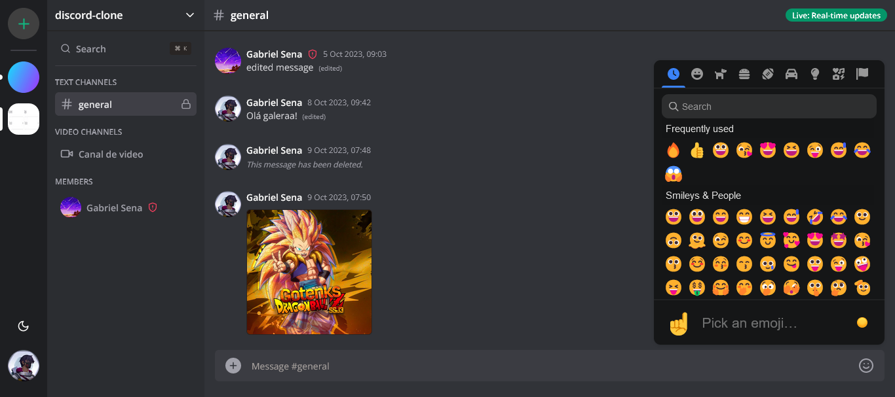

<div align="center">
  
</div>

<h1 align="center">
   Discord, Real-time Communication Channels
</h1>

An instant messaging application designed to offer a real-time communication experience. This robust chat platform was developed using a variety of modern technologies to create an immersive and interactive user experience.

Users can create and join various themed chat rooms for specific discussions. Each chat room offers a dedicated environment for interaction. The application uses Socket.io to enable real-time communication between users, enabling instant messaging and real-time notifications.

Livekit is built in to support voice and video calling, allowing users to have face-to-face or group conversations directly on the platform. It uses the Clerk library for secure user authentication and authorization, ensuring the protection of personal data. Radix and Shadcn/ui are employed to create an elegant and responsive design, providing a pleasant user experience on mobile and desktop devices.

Zustand is used to manage application state, ensuring data efficiency and consistency. The application uses React Hook Form to create interactive forms and the Zod library for data validation. React Query, part of the tanstack package, is used to effectively manage access to data and queries, improving performance and scalability. The Uploadthing library is used to support sending images, videos and other types of media in conversations.

The application provides a complete chat experience, from text messaging to voice and video communication, all in a secure environment. It is a platform for communities, groups of friends or work teams who want to communicate and collaborate in an effective and engaging way.

## :hammer_and_wrench: Tools

* TypeScript
* Next.js
* Radix
* Shadcn/ui
* Axios
* Livekit
* Socket.io
* Lucide React
* Uploadthing
* Zod
* Zustand
* Clerk
* React Hook Form
* React Query (tanstack)
* Query String
* Prisma

## :mailbox_with_mail: Utilities

### <strong>Zustand</strong>

"Zustand" is a state management library for React applications. It offers an alternative to using "Redux" to manage state in React applications, with the goal of simplifying application state management and making it easier to understand and maintain.

Zustand focuses on keeping state management as simple as possible. It utilizes a minimal API and provides a more direct way to declare, access, and update state compared to some other state management libraries. It's built on top of React hooks like useState and useEffect. This makes it easier to integrate with functional React components.

Zustand takes an immutable approach to updating state. Instead of directly modifying the state, it creates new states from existing ones, which helps prevent unintentional mutation errors. Zustand is designed to be performance efficient. It optimizes component re-rendering when the state is updated, ensuring that only relevant components are updated. And although it is simple to use, Zustand is flexible enough to handle complex states and advanced scenarios if necessary.

```ts
// hooks/use-modal-store.ts

import { Channel, ChannelType, Server } from "@prisma/client"
import { create } from "zustand"

export type ModalType =
  | "createServer"
  | "invite"
  | "editServer"
  | "members"
  | "createChannel"
  | "leaveServer"
  | "deleteServer"
  | "deleteChannel"
  | "editChannel"
  | "messageFile"
  | "deleteMessage"

interface ModalData {
  server?: Server
  channel?: Channel
  channelType?: ChannelType
  apiUrl?: string
  query?: Record<string, any>
}

interface ModalStore {
  type: ModalType | null
  data: ModalData
  isOpen: boolean
  onOpen: (type: ModalType, data?: ModalData) => void
  onClose: () => void
}

export const useModal = create<ModalStore>((set) => ({
  type: null,
  data: {},
  isOpen: false,
  onOpen: (type, data = {}) => set({ isOpen: true, type, data }),
  onClose: () => set({ type: null, isOpen: false }),
}))
```

### <strong>React Hook Form</strong>

"React Hook Form" is a popular library for managing forms in React applications. It greatly simplifies the process of creating, validating and manipulating forms in React projects, taking advantage of React's native concepts and hooks. React Hook Form is widely used by the React developer community due to its simplicity and efficiency.

As the name suggests, React Hook Form uses React's native hooks, such as useState and useEffect, to manage the state and behavior of forms. This makes integration with functional React components very simple.

The library allows conditional rendering of form fields based on specific rules, such as showing or hiding fields depending on user inputs. React Hook Form supports form field validation in an easy and customizable way. You can define your own validation rules or use third-party validation libraries. Adopts optimized state control, minimizing unnecessary component re-renders when interacting with form fields.

```tsx
// components/modals/create-channel-modal.tsx

const form = useForm({
  resolver: zodResolver(formSchema),
  defaultValues: {
    name: "",
    type: channelType || ChannelType.TEXT,
  },
})

const onSubmit = async (values: z.infer<typeof formSchema>) => {
  try {
    const url = qs.stringifyUrl({
      url: "/api/channels",
      query: {
        serverId: params?.serverId,
      },
    })
    await axios.post(url, values)

    form.reset()
    router.refresh()
    onClose()
  } catch (error) {
    console.log(error)
  }
}

return (
  <Dialog open={isModalOpen} onOpenChange={handleClose}>
    <DialogContent className="bg-white text-black p-0 overflow-hidden">
      <DialogHeader className="pt-8 px-6">
        <DialogTitle className="text-2xl text-center font-bold">
          Create Channel
        </DialogTitle>
      </DialogHeader>
      <Form {...form}>
        <form onSubmit={form.handleSubmit(onSubmit)} className="space-y-8">
          <div className="space-y-8 px-6">
            <FormField
              control={form.control}
              name="name"
              render={({ field }) => (
                <FormItem>
                  <FormLabel className="uppercase text-xs font-bold text-zinc-500 dark:text-secondary/70">
                    Channel name
                  </FormLabel>
                  <FormControl>
                    <Input
                      disabled={isLoading}
                      className="bg-zinc-300/50 border-0 focus-visible:ring-0 text-black focus-visible:ring-offset-0"
                      placeholder="Enter channel name"
                      {...field}
                    />
                  </FormControl>
                  <FormMessage />
                </FormItem>
              )}
            />
            <FormField
              control={form.control}
              name="type"
              render={({ field }) => (
                <FormItem>
                  <FormLabel className="uppercase text-xs font-bold text-zinc-500 dark:text-secondary/70">
                    Channel Type
                  </FormLabel>
                  <Select
                    disabled={isLoading}
                    onValueChange={field.onChange}
                    defaultValue={field.value}
                  >
                    <FormControl>
                      <SelectTrigger className="bg-zinc-300/50 border-0 focus:ring-0 text-black ring-offset-0 focus:ring-offset-0 capitalize outline-none">
                        <SelectValue placeholder="Select a channel type" />
                      </SelectTrigger>
                    </FormControl>
                    <SelectContent>
                      {Object.values(ChannelType).map((type, index) => (
                        <SelectItem
                          key={index}
                          value={type}
                          className="capitalize"
                        >
                          {type.toLowerCase()}
                        </SelectItem>
                      ))}
                    </SelectContent>
                  </Select>
                  <FormMessage />
                </FormItem>
              )}
            />
          </div>
          <DialogFooter className="bg-gray-100 px-6 py-4">
            <Button variant="primary" disabled={isLoading}>
              Create
            </Button>
          </DialogFooter>
        </form>
      </Form>
    </DialogContent>
  </Dialog>
)
```

### <strong>React Query</strong>

A state management library for React that focuses on asynchronous data such as API requests, caching, synchronization, and data manipulation in React applications. The `@tanstack/react-query` library is part of this ecosystem and is a specific package that helps integrate `react-query` with React.

`@tanstack/react-query` is designed to work seamlessly with React, leveraging React features like hooks to manage state and data logic. The library makes it easy to fetch, update, and manipulate asynchronous data in React applications, including running API queries and updating the application state in real time.

`react-query` includes an intelligent caching system that automatically caches query results, allowing you to save network resources and improve the user experience. It supports automatic data synchronization, which means that data is automatically updated in response to changes in server data, just like in a real-time environment. It also handles errors effectively, allowing you to control error handling in queries and mutations.

```ts
// hooks/use-chat-query.ts

import qs from "query-string"
import { useInfiniteQuery } from "@tanstack/react-query"

import { useSocket } from "@/components/providers/socket-provider"

interface ChatQueryProps {
  queryKey: string
  apiUrl: string
  paramKey: "channelId" | "conversationId"
  paramValue: string
}

export const useChatQuery = ({
  queryKey,
  apiUrl,
  paramKey,
  paramValue,
}: ChatQueryProps) => {
  const { isConnected } = useSocket()

  const fetchMessages = async ({ pageParam = undefined }) => {
    const url = qs.stringifyUrl(
      {
        url: apiUrl,
        query: {
          cursor: pageParam,
          [paramKey]: paramValue,
        },
      },
      { skipNull: true }
    )

    const res = await fetch(url)
    return res.json()
  }

  const { data, fetchNextPage, hasNextPage, isFetchingNextPage, status } =
    useInfiniteQuery({
      queryKey: [queryKey],
      queryFn: fetchMessages,
      getNextPageParam: (lastPage) => lastPage?.nextCursor,
      refetchInterval: isConnected ? false : 1000,
    })

  return { data, fetchNextPage, hasNextPage, isFetchingNextPage, status }
}
```

### <strong>Socket.io</strong>

Socket.IO is a JavaScript library that allows real-time communication between clients (web browsers) and servers. It simplifies the creation of web and mobile applications that require two-way communication, such as chat rooms, online games, real-time collaboration applications, and more. Here is some important information about Socket.IO:

Socket.IO allows two-way communication between the client and the server. This means that both the client and the server can send and receive data in real time. It uses a variety of communication protocols and transports, including WebSockets, AJAX long polling, among others. This ensures that real-time communication is possible even in restricted environments.

Socket.IO is easy to use and has a simple and intuitive API. You can quickly start using it in your web and mobile projects, it supports creating rooms and channels to allow specific groups of customers to communicate with each other. This is useful for creating chat rooms, game groups, etc. It includes automatic reconnection, which means that if the connection is temporarily lost, Socket.IO will automatically try to reconnect the client to the server.

```ts
// pages/api/socket/messages/[messageId].ts

export default async function handler(
  req: NextApiRequest,
  res: NextApiResponseServerIo
) {
  try {
    const profile = await currentProfilePages(req)
    const { messageId, serverId, channelId } = req.query
    const { content } = req.body

    // hidden code
 
    if (req.method === "PATCH") {
      if (!isMessageOwner) {
        return res.status(401).json({ error: "Unauthorized" })
      }
      message = await db.message.update({
        where: {
          id: messageId as string,
        },
        data: {
          content,
        },
        include: {
          member: {
            include: {
              profile: true,
            },
          },
        },
      })
    }

    const updateKey = `chat:${channelId}:messages:update`

    res?.socket?.server?.io?.emit(updateKey, message)

    return res.status(200).json(message)
  } catch (error) {
    console.log("[MESSAGE_ID]", error)
    return res.status(405).json({ error: "Internal Error" })
  }
}

```

```ts
// hooks/use-chat-socket.ts

import { useQueryClient } from "@tanstack/react-query"

import { useSocket } from "@/components/providers/socket-provider"
import { useEffect } from "react"
import { Member, Message, Profile } from "@prisma/client"

type ChatSocketProps = {
  addKey: string
  updateKey: string
  queryKey: string
}

type MessageWithMemberWithProfile = Message & {
  member: Member & {
    profile: Profile
  }
}

export const useChatSocket = ({
  addKey,
  updateKey,
  queryKey,
}: ChatSocketProps) => {
  const { socket } = useSocket()
  const queryClient = useQueryClient()

  useEffect(() => {
    if (!socket) {
      return
    }

    socket.on(updateKey, (message: MessageWithMemberWithProfile) => {
      queryClient.setQueryData([queryKey], (oldData: any) => {
        if (!oldData || !oldData.pages || oldData.pages.length === 0) {
          return oldData
        }

        const newData = oldData.pages.map((page: any) => {
          return {
            ...page,
            items: page.items.map((item: MessageWithMemberWithProfile) => {
              if (item.id === message.id) {
                return message
              }
              return item
            }),
          }
        })

        return {
          ...oldData,
          pages: newData,
        }
      })
    })

    socket.on(addKey, (message: MessageWithMemberWithProfile) => {
      queryClient.setQueryData([queryKey], (oldData: any) => {
        if (!oldData || !oldData.pages || oldData.pages.length === 0) {
          return {
            pages: [
              {
                items: [message],
              },
            ],
          }
        }

        const newData = [...oldData.pages]
        newData[0] = {
          ...newData[0],
          items: [message, ...newData[0].items],
        }

        return {
          ...oldData,
          pages: newData,
        }
      })
    })

    return () => {
      socket.off(addKey)
      socket.off(updateKey)
    }
  }, [queryClient, addKey, queryKey, updateKey, socket])
}
```




<p align="center">Project studied with :blue_heart: by <a href="https://github.com/stardusteight-d4c">Gabriel Sena</a></p> 
<p align="center">From channel :fire: <a href="https://www.youtube.com/@codewithantonio">Code With Antonio</a></p>
